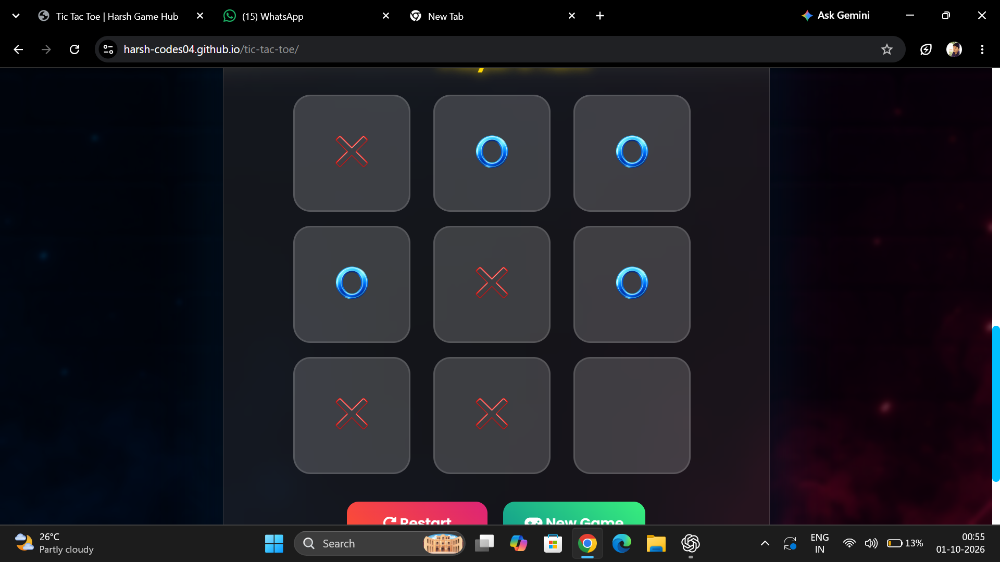

# 🎮 Tic Tac Toe Pro

A modern and responsive **Tic Tac Toe** game built using **HTML, CSS, and JavaScript**.

This project features a beautiful gaming interface, sound effects, score tracking, winner popup, local storage, and responsive design.

---

## 📸 Preview

>Play 🎮
>


---

## 🚀 Live Demo

🌐 https://harsh-codes04.github.io/tic-tac-toe-pro/

> Replace the URL if your repository name is different.

---

## ✨ Features

- 🎮 Modern Gaming UI
- ❌ Image-based X
- ⭕ Image-based O
- 🔊 Sound Effects
- 🏆 Winner Popup
- 📊 Live Scoreboard
- 💾 Local Storage
- 🔄 Restart Game
- 🆕 New Game
- 📱 Fully Responsive
- 🎨 Glassmorphism Design
- 🌌 Animated Background

---

## 🛠️ Technologies Used

- HTML5
- CSS3
- JavaScript (ES6)
- Local Storage API
- GitHub Pages

---

## 📂 Project Structure

```
tic-tac-toe-pro/
│
├── index.html
├── style.css
├── script-pro.js
├── README.md
│
├── images/
│   ├── background.png
│   ├── logo.jpg
│   ├── trophy.png
│   ├── x.png
│   └── o.png
│
└── sounds/
    ├── click.mp3
    ├── draw.mp3
    ├── restart.mp3
    └── win.mp3
```

---

## ▶️ How to Run

1. Download or clone this repository.

```bash
git clone https://github.com/Harsh-codes04/tic-tac-toe-pro.git
```

2. Open the project in **Visual Studio Code**.

3. Install the **Live Server** extension.

4. Right-click **index.html**.

5. Select **Open with Live Server**.

---

## 🎯 Controls

| Action | Description |
|---------|-------------|
| Mouse Click | Place X or O |
| Restart | Restart current match |
| New Game | Reset scores and start again |

---

## 📷 Screenshots

### Home Screen

Add screenshot here.

### Gameplay

Add screenshot here.

### Winner Popup

Add screenshot here.

---

## 📈 Future Improvements

- 🤖 Player vs AI
- 🧠 Hard AI (Minimax)
- 🎉 Confetti Animation
- 🏆 Winning Line Animation
- 🌙 Dark / Light Mode
- 🎵 Background Music
- 👤 Player Name Input
- 📊 Match History
- 🏅 Achievements

---

## 🤝 Contributing

Contributions are welcome.

1. Fork the repository.
2. Create a new branch.
3. Commit your changes.
4. Open a Pull Request.

---

## 📄 License

This project is licensed under the **MIT License**.

---

## 👨‍💻 Developer

**Harsh Chendake**

- GitHub: https://github.com/Harsh-codes04

---

## ⭐ Support

If you enjoyed this project, please consider giving it a ⭐ on GitHub.

It helps others discover the project and motivates future improvements.

---

### Thank You ❤️

Happy Coding! 🚀
